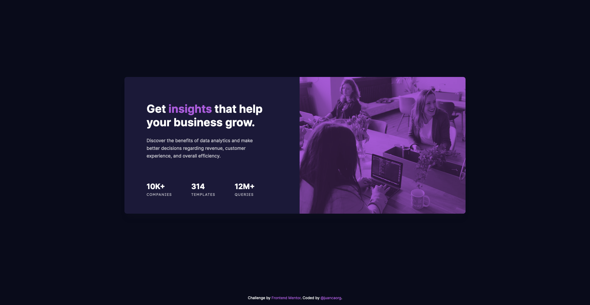

# Frontend Mentor - Stats Preview Card

This is a solution to the [Stats preview card component challenge on Frontend Mentor](https://www.frontendmentor.io/challenges/stats-preview-card-component-8JqbgoU62). Frontend Mentor challenges help you improve your coding skills by building realistic projects.

## Table of contents

- [Overview](#overview)
  - [The challenge](#the-challenge)
  - [Screenshot](#screenshot)
  - [Links](#links)
- [My process](#my-process)
  - [Built with](#built-with)
  - [What I learned](#what-i-learned)
- [Author](#author)
- [Acknowledgments](#acknowledgments)

## Overview

### The challenge

Users should be able to:

- View the optimal layout depending on their device's screen size

### Screenshot



### Links

- Solution URL: [GitHub Respository](https://github.com/juancaorg/stats-preview-card)
- Live Site URL: [statspreviewcard.juanca.dev](https://statspreviewcard.juanca.dev)

## My process

### Built with

- Semantic HTML5 markup
- CSS custom properties
- CSS Flexbox
- CSS Grid
- Mobile-first workflow

### What I learned

I learned how to filter an image with a color using the [`mix-blend-mode`](https://developer.mozilla.org/en-US/docs/Web/CSS/mix-blend-mode) CSS property.

Just remember that the element's content will blend with the content of the element's parent and the element's background.

In this case, I had to add a `.card__image-container` div as a parent element to the `picture` element to accomplish the above.

---

On the other hand, I also learned how to add an overlay element dynamically using the `::after` pseudo-element and `position: relative` and `position: absolute` instead of using CSS Grid.

At the end of the day, I didn't use this method. But will leave the info below for learning purposes.

One important note, all pseudo-elements require a `content` CSS property to display. In our case, this will just be a blank string.

This is an example selecting a `.banner`:

```css
.banner::after {
  content: ""; // ::before and ::after both require content
  position: absolute;
  top: 0;
  left: 0;
  width: 100%;
  height: 100%;
  background-image: linear-gradient(120deg, #eaee44, #33d0ff);
  opacity: 0.7;
}
```

Now we have an element that is full-width and -height. To do this, we utilize absolute positioning, as we don't want to affect the content flow of the document.

We make the overlay slightly transparent utilizing the opacity property.

## Author

- Website - [juanca.org](https://www.juanca.org)
- Frontend Mentor - [@juancaorg](https://www.frontendmentor.io/profile/juancaorg)
- Twitter - [@juancaorg](https://twitter.com/juancaorg)

## Acknowledgments

Thanks to [Bryan Robinson](https://bryanlrobinson.com/) for his guide on how to [use CSS `::before` and `::after` for simple, spicy image overlays](https://bryanlrobinson.com/blog/how-to-css-after-elements-for-background-overlays/). **Important update note:** I didn't use this at the end, but can become handy in the future.

Thanks to [@elaineleung](https://github.com/elaineleung) and [@PhoenixDev22](https://github.com/PhoenixDev22) for their excellent [feedback in a previous challenge](https://www.frontendmentor.io/solutions/nft-preview-card-component-built-using-css-grid-and-flexbox-9RnzPM81HJ) that helped me write the code for this challenge.

Thanks to [@correlucas](https://github.com/correlucas) for his feedback on how to use the `mix-blend-mode` CSS property. And thanks again to [@elaineleung](https://github.com/elaineleung) for her feedback on how to align content and normalize images and pictures.
